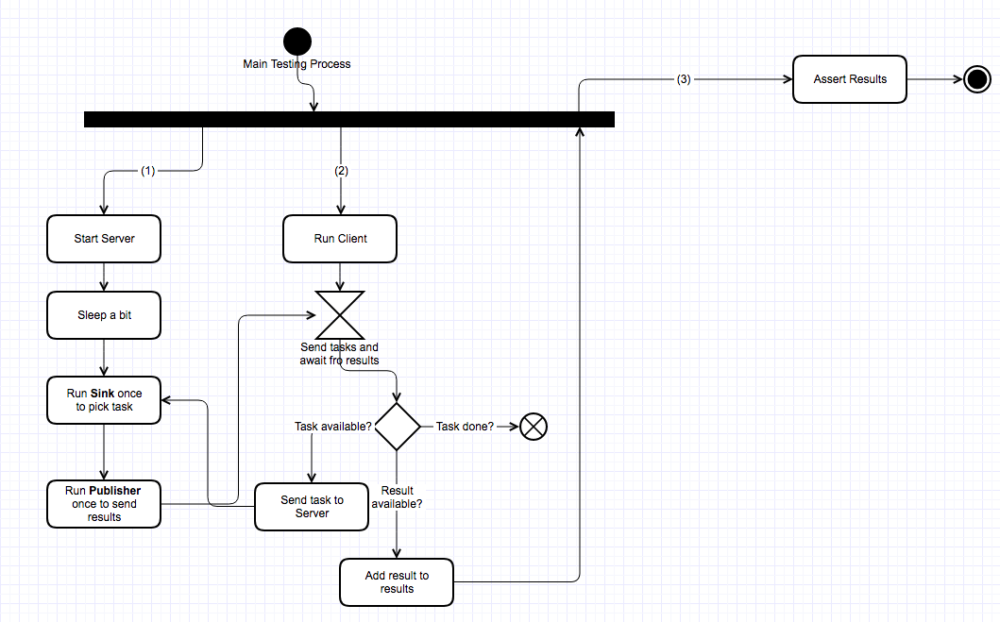

=============================
Functional Test Description
=============================

The test taking place here is testing the whole system from a functional point of view. There are a total of 2 processes
being involved as follows:

1.  A server process
2.  Client and Main parent process

The idea is to simulate how the system in production would behave when connecting to a server at the other side of
the fence. The simulation goes like this:

1.  **Server**: A server process is started and will sleep for a couple of seconds to give the client and main parent
    process time to send the tasks over. Then it will pick such sent task from the ``Sink`` to calculate the results
    as part of applying such task and immediately send back the results via a ``Publisher``.

2.  **Client and Main Parent process**: The client will run as part of the parent process and will wait until the server
    sends over the result. At such point the injected application dependency will mark the tasks as ``done`` and
    therefore the client will exit the loop

Below there is an activity diagram tha shows the interaction among the processes involved in the functional
test:

The key of this functional test is that the ``client`` is running as part of the parent process, therefore once it's
done with the sending and reception of the results, it is easy for the test units to assert if the results are the ones
expected.